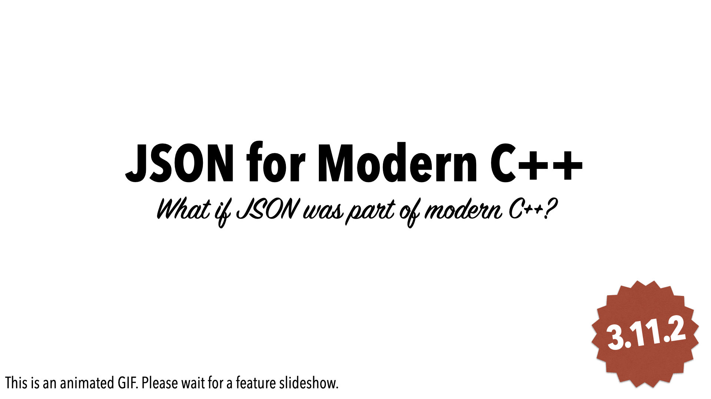

# JSON for Modern C++



JSON for Modern C++ is a header-only C++11 library that turns JSON into a first-class C++ data type, using the operator
magic of modern C++ so that creating, reading, and modifying JSON values feels as natural as it does in languages like
Python. The whole library is available as a single header, `json.hpp`, with no dependencies, no subproject, and no
complex build system to set up; a companion header, `json_fwd.hpp`, provides forward declarations to keep compile times
down. See [header-only integration](integration/index.md) for details. It is heavily unit-tested with 100% code
coverage, checked with Valgrind and the Clang Sanitizers for memory leaks, and continuously fuzz-tested by Google
OSS-Fuzz.

## Quick start

Add the single header to your project and use the library like this:

```cpp
#include <iostream>
#include <nlohmann/json.hpp>

using json = nlohmann::json;

int main()
{
    // parse a JSON string
    json j = json::parse(R"({"happy": true, "pi": 3.141})");

    // access and modify values
    j["name"] = "Niels";
    j["list"] = {1, 0, 2};

    // serialize with an indent of 4 spaces
    std::cout << j.dump(4) << '\n';
}
```

Get the library by copying the single header [`json.hpp`](https://github.com/nlohmann/json/releases) from the
releases page into a directory `nlohmann` on your include path, or by installing it with a package manager:

```sh
brew install nlohmann-json    # Homebrew
vcpkg install nlohmann-json   # vcpkg
```

```cmake
find_package(nlohmann_json 3.12.0 REQUIRED)
target_link_libraries(myproject PRIVATE nlohmann_json::nlohmann_json)
```

See [Integration](integration/index.md) for CMake in detail, all supported package managers (Conan, Meson, Bazel,
Conda, and more), and pkg-config.

## Explore the documentation

<div class="grid cards" markdown>

-   :octicons-rocket-24:{ .lg .middle } __Features__

    ---

    Creating, parsing, accessing, and serializing JSON values, JSON Pointer/Patch, binary formats, and more.

    [:octicons-arrow-right-24: Features](features/index.md)

-   :octicons-package-24:{ .lg .middle } __Integration__

    ---

    Add the library to your project via a single header, CMake, a package manager, or pkg-config.

    [:octicons-arrow-right-24: Integration](integration/index.md)

-   :octicons-book-24:{ .lg .middle } __API documentation__

    ---

    The complete reference for `basic_json` and its member functions, types, and related classes.

    [:octicons-arrow-right-24: API documentation](api/basic_json/index.md)

-   :octicons-question-24:{ .lg .middle } __FAQ__

    ---

    Answers to common questions and known surprises when using the library.

    [:octicons-arrow-right-24: FAQ](home/faq.md)

-   :octicons-tag-24:{ .lg .middle } __Releases__

    ---

    What changed in each release, with links to the relevant documentation.

    [:octicons-arrow-right-24: Releases](home/releases.md)

-   :octicons-people-24:{ .lg .middle } __Community__

    ---

    The ecosystem, contribution guidelines, governance, and quality assurance around the project.

    [:octicons-arrow-right-24: Community](community/index.md)

</div>

!!! info "Unreleased changes"

    This documentation is built from the `develop` branch and may describe changes that are not part of a release
    yet. Their version numbers are followed by an <span class="unreleased-version">unreleased</span> badge; see
    [Releases](home/releases.md) for what shipped in each version.

The library is licensed under the [MIT License](home/license.md). The source code, issue tracker, and discussions
are on [GitHub](https://github.com/nlohmann/json).
