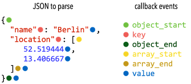

# <small>nlohmann::basic_json::</small>parser_callback_t

```cpp
template<typename BasicJsonType>
using parser_callback_t =
    std::function<bool(int depth, parse_event_t event, BasicJsonType& parsed)>;
```

With a parser callback function, the result of parsing a JSON text can be influenced. When passed to
[`parse`](parse.md), it is called on certain events (passed as [`parse_event_t`](parse_event_t.md) via parameter
`event`) with a set recursion depth `depth` and context JSON value `parsed`. The return value of the callback function
is a boolean indicating whether the element that emitted the callback shall be kept or not.

We distinguish six scenarios (determined by the event type) in which the callback function can be called. The following
table describes the values of the parameters `depth`, `event`, and `parsed`.

| parameter `event`             | description                                               | parameter `depth`                         | parameter `parsed`               |
|-------------------------------|-----------------------------------------------------------|-------------------------------------------|----------------------------------|
| `parse_event_t::object_start` | the parser read `{` and started to process a JSON object  | depth of the parent of the JSON object    | a JSON value with type discarded |
| `parse_event_t::key`          | the parser read a key of a value in an object             | depth of the currently parsed JSON object | a JSON string containing the key |
| `parse_event_t::object_end`   | the parser read `}` and finished processing a JSON object | depth of the parent of the JSON object    | the parsed JSON object           |
| `parse_event_t::array_start`  | the parser read `[` and started to process a JSON array   | depth of the parent of the JSON array     | a JSON value with type discarded |
| `parse_event_t::array_end`    | the parser read `]` and finished processing a JSON array  | depth of the parent of the JSON array     | the parsed JSON array            |
| `parse_event_t::value`        | the parser finished reading a JSON value                  | depth of the value                        | the parsed JSON value            |



Discarding a value (i.e., returning `#!cpp false`) has different effects depending on the context in which function was
called:

- Discarded values in structured types are skipped. That is, the parser will behave as if the discarded value was never
  read. This holds for every value type and for both kinds of parent: a discarded element is removed from the
  surrounding array, and a discarded member is removed from the surrounding object together with its key.
- Arrays and objects can be discarded either at their `parse_event_t::array_start`/`parse_event_t::object_start` event
  or at their `parse_event_t::array_end`/`parse_event_t::object_end` event, and both remove the whole value. Discarding
  it at the start event also means the callback is called neither for the content of the value nor for its matching end
  event.
- Discarding a `parse_event_t::key` event discards the whole object member. The callback is still called for the
  associated value, but its return value has no further effect.
- In case a value outside a structured type is skipped, it is replaced with `null`. This case happens if the top-level
  element is skipped.

## Parameters

`depth` (in)
:   the depth of the recursion during parsing

`event` (in)
:   an event of type [`parse_event_t`](parse_event_t.md) indicating the context in
    the callback function has been called

`parsed` (in, out)
:    the current intermediate parse result; note that
     writing to this value has no effect for `parse_event_t::key` events

## Return value

Whether the JSON value which called the function during parsing should be kept (`#!cpp true`) or not (`#!cpp false`). In
the latter case, it is skipped completely, or replaced by `null` if it is the top-level value.

## Examples

??? example

    The example below demonstrates the `parse()` function with
    and without callback function.

    ```cpp
    --8<-- "examples/parse__string__parser_callback_t.cpp"
    ```
    
    Output:
    
    ```json
    --8<-- "examples/parse__string__parser_callback_t.output"
    ```

??? example

    The example below shows where discarded values are removed. The array and the number are discarded in different
    ways, but in each case the parse result contains neither the value nor its key.

    ```cpp
    --8<-- "examples/parser_callback_t.cpp"
    ```

    Output:

    ```json
    --8<-- "examples/parser_callback_t.output"
    ```

## See also

- [parse](parse.md) deserialize from a compatible input
- [parse_event_t](parse_event_t.md) enumeration of parser events

## Version history

- Added in version 1.0.0.
- Fixed in version 3.13.0 to also remove discarded values from a parent object; before, discarding an array or a value
  stored under an object key left a discarded member behind, which made the parse result serialize to invalid JSON.
