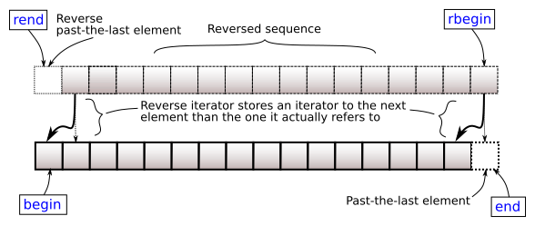

# <small>nlohmann::basic_json::</small>rbegin

```cpp
reverse_iterator rbegin() noexcept;
const_reverse_iterator rbegin() const noexcept;
```

Returns an iterator to the reverse-beginning; that is, the last element.



## Return value

reverse iterator to the last element

## Exception safety

No-throw guarantee: this member function never throws exceptions.

## Complexity

Constant.

## Examples

??? example

    The following code shows an example for `rbegin()`.
    
    ```cpp
    --8<-- "examples/rbegin.cpp"
    ```
    
    Output:
    
    ```json
    --8<-- "examples/rbegin.output"
    ```

## See also

- [rend](rend.md) returns a reverse iterator to one before the first element
- [crbegin](crbegin.md) returns a const reverse iterator to the last element
- [begin](begin.md) returns an iterator to the first element
- [Iterators](../../features/iterators.md) - the article on iterators

## Version history

- Added in version 1.0.0.
