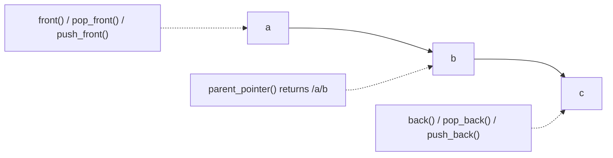

# <small>nlohmann::</small>json_pointer

```cpp
template<typename RefStringType>
class json_pointer;
```

A JSON pointer defines a string syntax for identifying a specific value within a JSON document. It can be used with
functions [`at`](../basic_json/at.md) and [`operator[]`](../basic_json/operator%5B%5D.md). Furthermore, JSON pointers
are the base for JSON patches.

## Template parameters

`RefStringType`
:   the string type used for the reference tokens making up the JSON pointer

!!! warning "Deprecation"

    For backwards compatibility `RefStringType` may also be a specialization of [`basic_json`](../basic_json/index.md)
    in which case `string_t` will be deduced as [`basic_json::string_t`](../basic_json/string_t.md). This feature is
    deprecated and may be removed in a future major version.

    See the [migration guide](../../integration/migration_guide.md#json-pointers) for how to update existing code.

A JSON pointer is internally a sequence of reference tokens. [`front`](front.md), [`pop_front`](pop_front.md), and
[`push_front`](push_front.md) act on the first reference token, whereas [`back`](back.md), [`pop_back`](pop_back.md),
and [`push_back`](push_back.md) act on the last one. [`parent_pointer`](parent_pointer.md) returns a new JSON pointer
with the last reference token removed (like a non-mutating [`pop_back`](pop_back.md)):



The diagram shows the reference tokens of the JSON pointer `/a/b/c`.

## Member types

- [**string_t**](string_t.md) - the string type used for the reference tokens

## Member functions

- [(constructor)](json_pointer.md)
- [**to_string**](to_string.md) - return a string representation of the JSON pointer
- [**operator string_t**](operator_string_t.md) - return a string representation of the JSON pointer (deprecated)
- [**operator==**](operator_eq.md) - compare: equal
- [**operator!=**](operator_ne.md) - compare: not equal
- [**operator<=>**](operator_spaceship.md) - compare: 3-way (C++20)
- [**operator/=**](operator_slasheq.md) - append to the end of the JSON pointer
- [**operator/**](operator_slash.md) - create JSON Pointer by appending
- [**parent_pointer**](parent_pointer.md) - returns the parent of this JSON pointer
- [**pop_back**](pop_back.md) - remove the last reference token
- [**back**](back.md) - return last reference token
- [**push_back**](push_back.md) - append an unescaped token at the end of the pointer
- [**pop_front**](pop_front.md) - remove the first reference token
- [**front**](front.md) - return first reference token
- [**push_front**](push_front.md) - append an unescaped token at the start of the pointer
- [**empty**](empty.md) - return whether the pointer points to the root document

## Literals

- [**operator""_json_pointer**](../operator_literal_json_pointer.md) - user-defined string literal for JSON pointers

## See also

- [RFC 6901](https://datatracker.ietf.org/doc/html/rfc6901)

## Version history

- Added in version 2.0.0.
- Changed template parameter from `basic_json` to string type in version 3.11.0.
