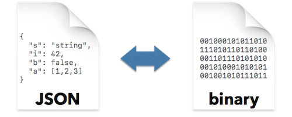

# Binary formats



Several formats exist that encode JSON values in a binary format to reduce the size of the encoded value as well as the required effort to parse encoded value. The library implements three formats, namely

- [CBOR](https://tools.ietf.org/html/rfc7049) (Concise Binary Object Representation)
- [MessagePack](https://msgpack.org)
- [UBJSON](http://ubjson.org) (Universal Binary JSON)

## Interface

### JSON to binary format

For each format, the `to_*` functions (i.e., `to_cbor`, `to_msgpack`, and `to_ubjson`) convert a JSON value into the respective binary format. Taking CBOR as example, the concrete prototypes are:

```cpp
static std::vector<uint8_t> to_cbor(const basic_json& j);                    // 1
static void to_cbor(const basic_json& j, detail::output_adapter<uint8_t> o); // 2
static void to_cbor(const basic_json& j, detail::output_adapter<char> o);    // 3
```

The first function creates a byte vector from the given JSON value. The second and third function writes to an output adapter of `uint8_t` and `char`, respectively. Output adapters are implemented for strings, output streams, and vectors.

Given a JSON value `j`, the following calls are possible:

```cpp
std::vector<uint8_t> v;
v = json::to_cbor(j);   // 1

json::to_cbor(j, v);    // 2

std::string s;
json::to_cbor(j, s);    // 3

std::ostringstream oss;
json::to_cbor(j, oss);  // 3
```

### Binary format to JSON

Likewise, the `from_*` functions (i.e, `from_cbor`, `from_msgpack`, and `from_ubjson`) convert a binary encoded value into a JSON value. Taking CBOR as example, the concrete prototypes are:

```cpp
static basic_json from_cbor(detail::input_adapter i, const bool strict = true); // 1
static basic_json from_cbor(A1 && a1, A2 && a2, const bool strict = true);      // 2
```

Both functions read from an input adapter: the first function takes it directly form argument `i`, whereas the second function creates it from the provided arguments `a1` and `a2`. If the optional parameter `strict` is true, the input must be read completely (or a parse error exception is thrown). If it is false, parsing succeeds even if the input is not completely read.

Input adapters are implemented for input streams, character buffers, string literals, and iterator ranges.

Given several inputs (which we assume to be filled with a CBOR value), the following calls are possible:

```cpp
std::string s;
json j1 = json::from_cbor(s);                         // 1

std::ifstream is("somefile.cbor", std::ios::binary);
json j2 = json::from_cbor(is);                        // 1

std::vector<uint8_t> v;
json j3 = json::from_cbor(v);                         // 1

const char* buff;
std::size_t buff_size;
json j4 = json::from_cbor(buff, buff_size);           // 2
```

## Details

### CBOR

The mapping from CBOR to JSON is **incomplete** in the sense that not all CBOR types can be converted to a JSON value. The following CBOR types are not supported and will yield parse errors (parse_error.112):

- byte strings (0x40..0x5F)
- date/time (0xC0..0xC1)
- bignum (0xC2..0xC3)
- decimal fraction (0xC4)
- bigfloat (0xC5)
- tagged items (0xC6..0xD4, 0xD8..0xDB)
- expected conversions (0xD5..0xD7)
- simple values (0xE0..0xF3, 0xF8)
- undefined (0xF7)

CBOR further allows map keys of any type, whereas JSON only allows strings as keys in object values. Therefore, CBOR maps with keys other than UTF-8 strings are rejected (parse_error.113).

The mapping from JSON to CBOR is **complete** in the sense that any JSON value type can be converted to a CBOR value.

If NaN or Infinity are stored inside a JSON number, they are serialized properly. This behavior differs from the dump() function which serializes NaN or Infinity to null.

The following CBOR types are not used in the conversion:

- byte strings (0x40..0x5F)
- UTF-8 strings terminated by "break" (0x7F)
- arrays terminated by "break" (0x9F)
- maps terminated by "break" (0xBF)
- date/time (0xC0..0xC1)
- bignum (0xC2..0xC3)
- decimal fraction (0xC4)
- bigfloat (0xC5)
- tagged items (0xC6..0xD4, 0xD8..0xDB)
- expected conversions (0xD5..0xD7)
- simple values (0xE0..0xF3, 0xF8)
- undefined (0xF7)
- half and single-precision floats (0xF9-0xFA)
- break (0xFF)

### MessagePack

The mapping from MessagePack to JSON is **incomplete** in the sense that not all MessagePack types can be converted to a JSON value. The following MessagePack types are not supported and will yield parse errors:

- bin 8 - bin 32 (0xC4..0xC6)
- ext 8 - ext 32 (0xC7..0xC9)
- fixext 1 - fixext 16 (0xD4..0xD8)

The mapping from JSON to MessagePack is **complete** in the sense that any JSON value type can be converted to a MessagePack value.

The following values can not be converted to a MessagePack value:

- strings with more than 4294967295 bytes
- arrays with more than 4294967295 elements
- objects with more than 4294967295 elements

The following MessagePack types are not used in the conversion:

- bin 8 - bin 32 (0xC4..0xC6)
- ext 8 - ext 32 (0xC7..0xC9)
- float 32 (0xCA)
- fixext 1 - fixext 16 (0xD4..0xD8)

Any MessagePack output created `to_msgpack` can be successfully parsed by `from_msgpack`.

If NaN or Infinity are stored inside a JSON number, they are serialized properly. This behavior differs from the `dump()` function which serializes NaN or Infinity to `null`.

### UBJSON

The mapping from UBJSON to JSON is **complete** in the sense that any UBJSON value can be converted to a JSON value.

The mapping from JSON to UBJSON is **complete** in the sense that any JSON value type can be converted to a UBJSON value.

The following values can not be converted to a UBJSON value:

- strings with more than 9223372036854775807 bytes (theoretical)
- unsigned integer numbers above 9223372036854775807

The following markers are not used in the conversion:

- `Z`: no-op values are not created.
- `C`: single-byte strings are serialized with S markers.

Any UBJSON output created to_ubjson can be successfully parsed by from_ubjson.

If NaN or Infinity are stored inside a JSON number, they are serialized properly. This behavior differs from the `dump()` function which serializes NaN or Infinity to null.

The optimized formats for containers are supported: Parameter `use_size` adds size information to the beginning of a container and removes the closing marker. Parameter `use_type` further checks whether all elements of a container have the same type and adds the type marker to the beginning of the container. The `use_type` parameter must only be used together with `use_size = true`. Note that `use_size = true` alone may result in larger representations - the benefit of this parameter is that the receiving side is immediately informed on the number of elements of the container.

## Size comparison examples

The following table shows the size compared to the original JSON value for different files from the repository for the different formats.

| format                  | sample.json | all_unicode.json | floats.json | signed_ints.json | jeopardy.json | canada.json |
| ----------------------- | -----------:| ----------------:| -----------:| ----------------:| -------------:| -----------:|
| JSON                    |    100.00 % |         100.00 % |    100.00 % |         100.00 % |      100.00 % |    100.00 % |
| CBOR                    |     87.21 % |          71.18 % |     48.20 % |          44.16 % |       87.96 % |     50.53 % |
| MessagePack             |     87.16 % |          71.18 % |     48.20 % |          44.16 % |       87.91 % |     50.56 % |
| UBJSON unoptimized      |     88.15 % |         100.00 % |     48.20 % |          44.16 % |       96.58 % |     53.20 % |
| UBJSON size-optimized   |     89.26 % |         100.00 % |     48.20 % |          44.16 % |       97.40 % |     58.56 % |
| UBJSON format-optimized |     89.45 % |         100.00 % |     42.85 % |          39.26 % |       94.96 % |     55.93 % |

The results show that there does not exist a "best" encoding. Furthermore, it is not always worthwhile to use UBJSON's optimizations.
