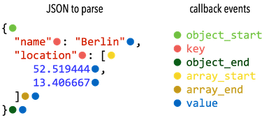

# basic_json::parse_event_t

```cpp
enum class parse_event_t : std::uint8_t {
    object_start,
    object_end,
    array_start,
    array_end,
    key,
    value
};
```

The parser callback distinguishes the following events:

- `object_start`: the parser read `{` and started to process a JSON object
- `key`: the parser read a key of a value in an object
- `object_end`: the parser read `}` and finished processing a JSON object
- `array_start`: the parser read `[` and started to process a JSON array
- `array_end`: the parser read `]` and finished processing a JSON array
- `value`: the parser finished reading a JSON value

## Example



## Version history

- Added in version 1.0.0.
