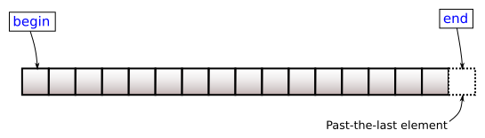

# <small>nlohmann::basic_json::</small>end

```cpp
iterator end() noexcept;
const_iterator end() const noexcept;
```

Returns an iterator to one past the last element.



## Return value

iterator one past the last element

## Exception safety

No-throw guarantee: this member function never throws exceptions.

## Complexity

Constant.

## Examples

??? example

    The following code shows an example for `end()`.
    
    ```cpp
    --8<-- "examples/end.cpp"
    ```
    
    Output:
    
    ```json
    --8<-- "examples/end.output"
    ```

## See also

- [begin](begin.md) returns an iterator to the first element
- [cend](cend.md) returns a const iterator to one past the last element
- [rend](rend.md) returns a reverse iterator to one before the first element
- [Iterators](../../features/iterators.md) - the article on iterators
- [basic_json_view::end](../basic_json_view/end.md) - the same iteration on a zero-copy view

## Version history

- Added in version 1.0.0.
