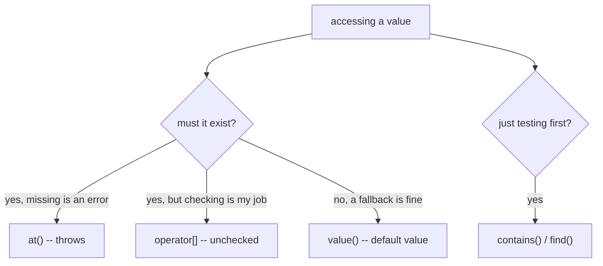

# Element Access

There are many ways elements in a JSON value can be accessed:

- unchecked access via [`operator[]`](unchecked_access.md)
- checked access via [`at`](checked_access.md)
- access with default value via [`value`](default_value.md)
- [iterators](../iterators.md)
- [JSON pointers](../json_pointer.md)

Testing whether a key or index exists before accessing it is also possible, with
[`contains`](../../api/basic_json/contains.md) or [`find`](../../api/basic_json/find.md) (which returns an iterator to
the value, or `end()` if it is not found).

