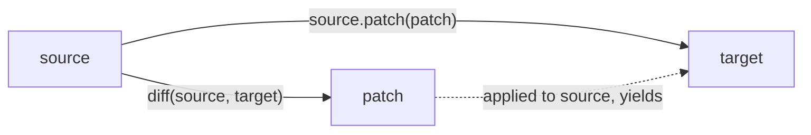

# JSON Patch and Diff

## Patches

JSON Patch ([RFC 6902](https://tools.ietf.org/html/rfc6902)) defines a JSON document structure for expressing a sequence
of operations to apply to a JSON document. Operations address locations in the document using
[JSON Pointer](json_pointer.md) paths. With the [`patch`](../api/basic_json/patch.md) function, a JSON Patch is applied
to the current JSON value by executing all operations from the patch, yielding the patched document as a new value.

!!! tip "Applying a patch without copying"

    [`patch`](../api/basic_json/patch.md) leaves the original value unchanged and returns the patched result as a copy.
    If the document is large and the original value is no longer needed,
    [`patch_inplace`](../api/basic_json/patch_inplace.md) applies the same operations in place instead.

??? example "Example: apply a JSON Patch"

    The following code shows how a JSON patch is applied to a value.

    ```cpp
    --8<-- "examples/patch.cpp"
    ```
    
    Output:

    ```json
    --8<-- "examples/patch.output"
    ```

## Diff

The library can also calculate a JSON patch (i.e., a **diff**) given two JSON values with the
[`diff`](../api/basic_json/diff.md) function.



!!! success "Invariant"

    For two JSON values *source* and *target*, the following code yields always true:

    ```cpp
    source.patch(diff(source, target)) == target;
    ```

??? example "Example: create a JSON Patch from the difference of two values"

    The following code shows how a JSON patch is created as a diff for two JSON values.

    ```cpp
    --8<-- "examples/diff.cpp"
    ```
    
    Output:

    ```json
    --8<-- "examples/diff.output"
    ```

## See also

- [JSON Pointer](json_pointer.md) - the addressing scheme used for patch paths
- [JSON Merge Patch](merge_patch.md) - a simpler, less expressive alternative patch format
- [`patch`](../api/basic_json/patch.md) - apply a JSON Patch, returning the result as a copy
- [`patch_inplace`](../api/basic_json/patch_inplace.md) - apply a JSON Patch without copying
- [`diff`](../api/basic_json/diff.md) - compute a JSON Patch from two values
