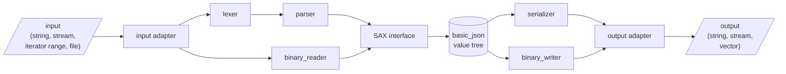

# Architecture

This page gives a high-level overview of the library's architecture. It should help new contributors to get an idea of
the used concepts and where to make changes.

## Overview

The library is built around a single class template, [`nlohmann::basic_json`](../api/basic_json/index.md). A
`basic_json` value is a node in a tree of JSON values. All other components either create such a tree from an input
(parsing), write a tree to an output (serialization), or give access to it (iterators, JSON Pointer, conversions).



- **JSON text** is read by an [input adapter](#input-adapters), tokenized by the lexer, and turned into SAX events by
  the parser.
- **Binary formats** (BJData, BSON, CBOR, MessagePack, UBJSON) are read by an input adapter and turned into the same SAX
  events by the `binary_reader`.
- A [SAX consumer](#sax-interface) receives the events. The one used by [`parse`](../api/basic_json/parse.md) builds a
  `basic_json` value tree.
- The `serializer` (JSON text) or the `binary_writer` (binary formats) writes a value tree to an
  [output adapter](#output-adapters).

## Source layout

The public headers are `include/nlohmann/json.hpp` (class `basic_json`) and `include/nlohmann/json_fwd.hpp` (forward
declarations). Everything else lives in `include/nlohmann/detail` and namespace `nlohmann::detail`, which is not part of
the public API.

| Component                              | Location                                                                    |
|----------------------------------------|-----------------------------------------------------------------------------|
| Value type enumeration                 | `detail/value_t.hpp`                                                        |
| Input adapters                         | `detail/input/input_adapters.hpp`                                           |
| Lexer                                  | `detail/input/lexer.hpp`, `detail/input/number_parse.hpp`                   |
| Parser                                 | `detail/input/parser.hpp`                                                   |
| SAX interface and DOM builders         | `detail/input/json_sax.hpp`                                                 |
| Binary format readers                  | `detail/input/binary_reader.hpp`                                            |
| JSON serializer                        | `detail/output/serializer.hpp`, `detail/conversions/to_chars.hpp`           |
| Binary format writers                  | `detail/output/binary_writer.hpp`                                           |
| Output adapters                        | `detail/output/output_adapters.hpp`                                         |
| Iterators                              | `detail/iterators/`                                                         |
| Conversions from/to arbitrary types    | `detail/conversions/from_json.hpp`, `detail/conversions/to_json.hpp`        |
| JSON Pointer                           | `detail/json_pointer.hpp`                                                   |
| Exceptions                             | `detail/exceptions.hpp`                                                     |
| Type traits and C++ feature backports  | `detail/meta/`                                                              |
| Macros                                 | `detail/macro_scope.hpp`, `detail/macro_unscope.hpp`, `detail/abi_macros.hpp` |

The single-header version `single_include/nlohmann/json.hpp` is generated from these files with `make amalgamate` and
must not be edited by hand.

## Template parameters

`basic_json` is parameterized by the types it uses to store values and to convert from and to other types:

| Template parameter   | Default                   | Used for                                                          |
|----------------------|---------------------------|-------------------------------------------------------------------|
| `ObjectType`         | `std::map`                | objects, see [`object_t`](../api/basic_json/object_t.md)          |
| `ArrayType`          | `std::vector`             | arrays, see [`array_t`](../api/basic_json/array_t.md)             |
| `StringType`         | `std::string`             | strings and object keys, see [`string_t`](../api/basic_json/string_t.md) |
| `BooleanType`        | `bool`                    | Booleans, see [`boolean_t`](../api/basic_json/boolean_t.md)       |
| `NumberIntegerType`  | `std::int64_t`            | signed integers, see [`number_integer_t`](../api/basic_json/number_integer_t.md) |
| `NumberUnsignedType` | `std::uint64_t`           | unsigned integers, see [`number_unsigned_t`](../api/basic_json/number_unsigned_t.md) |
| `NumberFloatType`    | `double`                  | floating-point numbers, see [`number_float_t`](../api/basic_json/number_float_t.md) |
| `AllocatorType`      | `std::allocator`          | allocating objects, arrays, strings, and binary values            |
| `JSONSerializer`     | `adl_serializer`          | conversions from/to other types, see [`adl_serializer`](../api/adl_serializer/index.md) |
| `BinaryType`         | `std::vector<std::uint8_t>` | binary values, see [`binary_t`](../api/basic_json/binary_t.md)  |
| `CustomBaseClass`    | `void`                    | an optional base class, see [`json_base_class_t`](../api/basic_json/json_base_class_t.md) |

The library provides two specializations:

- [`json`](../api/json.md) uses all default template arguments.
- [`ordered_json`](../api/ordered_json.md) uses [`ordered_map`](../api/ordered_map.md) as `ObjectType` to keep the
  insertion order of object keys.

The requirements on the template arguments are listed in
[Template Parameter Requirements](../features/types/template_parameters.md).

## Value storage

Each `basic_json` value stores its content as a tagged union: an enumeration [`value_t`](../api/basic_json/value_t.md)
names the type of the value, and a union `json_value` holds the value itself. Both are members of the nested struct
`data`, which is the only data member `m_data` of `basic_json`:

```cpp
struct data
{
    /// the type of the current element
    value_t m_type = value_t::null;

    /// the value of the current element
    json_value m_value = {};
};

data m_data = {};
```

with

```cpp
enum class value_t : std::uint8_t
{
    null,             ///< null value
    object,           ///< object (unordered set of name/value pairs)
    array,            ///< array (ordered collection of values)
    string,           ///< string value
    boolean,          ///< boolean value
    number_integer,   ///< number value (signed integer)
    number_unsigned,  ///< number value (unsigned integer)
    number_float,     ///< number value (floating-point)
    binary,           ///< binary array (ordered collection of bytes)
    discarded         ///< discarded by the parser callback function
};

union json_value {
  /// object (stored with pointer to save storage)
  object_t *object;
  /// array (stored with pointer to save storage)
  array_t *array;
  /// string (stored with pointer to save storage)
  string_t *string;
  /// binary (stored with pointer to save storage)
  binary_t *binary;
  /// boolean
  boolean_t boolean;
  /// number (integer)
  number_integer_t number_integer;
  /// number (unsigned integer)
  number_unsigned_t number_unsigned;
  /// number (floating-point)
  number_float_t number_float;
};
```

Objects, arrays, strings, and binary values are allocated on the heap with `AllocatorType`, and the union only stores a
pointer to them. This keeps a `basic_json` value small: one pointer-sized union and one byte for the type. The class
maintains the invariant that the pointer matching `m_type` is never null; `assert_invariant()` checks it with
[runtime assertions](../features/assertions.md).

## Input adapters

Input is read via **input adapters** that abstract a source with a common interface:

```cpp
/// read a single character
std::char_traits<char>::int_type get_character() noexcept;

/// read multiple characters to a destination buffer and
/// returns the number of characters successfully read
template<class T>
std::size_t get_elements(T* dest, std::size_t count = 1);
```

The function `input_adapter` picks the right adapter for the argument passed to `parse`, `accept`, `sax_parse`, or the
`from_*` functions:

- `iterator_input_adapter` reads from an iterator range, which also covers strings, containers, and pointers.
- `wide_string_input_adapter` reads from ranges of `wchar_t`, `char16_t`, or `char32_t` and converts them to UTF-8.
- `input_stream_adapter` reads from a `std::istream`.
- `file_input_adapter` reads from a `std::FILE*`.

## SAX interface

The parser does not build values itself. It reports what it reads as events to a [SAX](../features/parsing/sax_interface.md)
consumer, which implements the interface [`json_sax`](../api/json_sax/index.md): `null`, `boolean`, `number_integer`,
`number_unsigned`, `number_float`, `string`, `binary`, `start_object`, `key`, `end_object`, `start_array`, `end_array`,
and `parse_error`.

The library comes with two consumers in `detail/input/json_sax.hpp`:

- `json_sax_dom_parser` builds a `basic_json` value tree. [`parse`](../api/basic_json/parse.md) uses it.
- `json_sax_dom_callback_parser` does the same, but calls a [parser callback](../features/parsing/parser_callbacks.md)
  for each event, which can skip values. `parse` uses it when a callback is given.

The `binary_reader` emits the same events for binary formats, so [`sax_parse`](../api/basic_json/sax_parse.md) works
with a user-defined consumer for JSON and for all binary formats alike.

## Output adapters

Output is written via **output adapters**:

```cpp
void write_character(CharType c);

void write_characters(const CharType* s, std::size_t length);
```

The `serializer` (used by [`dump`](../api/basic_json/dump.md) and [`operator<<`](../api/operator_ltlt.md)) and the
`binary_writer` (used by the `to_*` functions) write to one of these adapters:

- `output_vector_adapter` appends to a `std::vector`.
- `output_stream_adapter` writes to a `std::ostream`.
- `output_string_adapter` appends to a string.

## Value conversion

Values are converted from and to other types with the `JSONSerializer` template parameter. The default,
[`adl_serializer`](../api/adl_serializer/index.md), calls the free functions

```cpp
template<class T>
void to_json(basic_json& j, const T& t);

template<class T>
void from_json(const basic_json& j, T& t);
```

found by argument-dependent lookup. The library defines them for standard types in `detail/conversions`; users add them
for their own types, see [Arbitrary Type Conversions](../features/arbitrary_types.md). The
[serialization macros](../features/macros.md) generate these functions.

## Additional features

- [JSON Pointer](../features/json_pointer.md) (class `json_pointer`) addresses values inside a tree. It is also the
  basis of [JSON Patch](../features/json_patch.md).
- [Binary formats](../features/binary_formats/index.md) are read by `binary_reader` and written by `binary_writer`.
- A [custom base class](../api/basic_json/json_base_class_t.md) can add members to every `basic_json` value.
- [Serialization macros](../features/macros.md) generate `to_json` and `from_json` functions for user-defined types.

## Details namespace

Namespace `nlohmann::detail` contains all implementation details. It is not part of the public API and may change in any
release. Besides the components above, it contains:

- type traits to detect the capabilities of user-defined types (`detail/meta/type_traits.hpp`),
- backports of C++14/17 features to C++11 (`detail/meta/cpp_future.hpp`), and
- helpers such as `string_concat` and `string_escape`.
