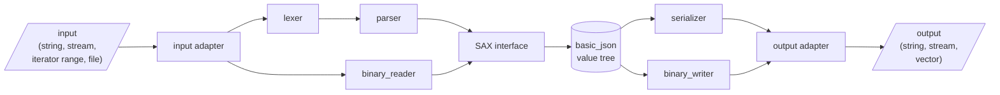
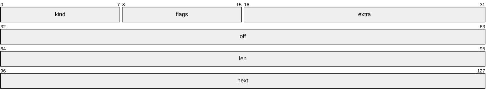
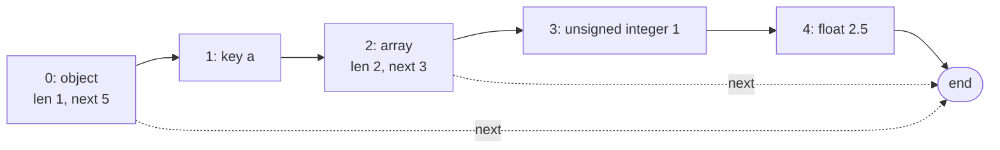

# Architecture

This page gives a high-level overview of the library's architecture. It should help new contributors to get an idea of
the used concepts and where to make changes.

## Overview

The library is built around a single class template, [`nlohmann::basic_json`](../api/basic_json/index.md). A
`basic_json` value is a node in a tree of JSON values. All other components either create such a tree from an input
(parsing), write a tree to an output (serialization), or give access to it (iterators, JSON Pointer, conversions).


```mermaid
flowchart LR
    input[/"input<br>(string, stream,<br>iterator range, file)"/]
    ia["input adapter"]
    lexer["lexer"]
    parser["parser"]
    breader["binary_reader"]
    sax["SAX interface"]
    value[("basic_json<br>value tree")]
    serializer["serializer"]
    bwriter["binary_writer"]
    oa["output adapter"]
    output[/"output<br>(string, stream,<br>vector)"/]

    input --> ia
    ia --> lexer --> parser --> sax
    ia --> breader --> sax
    sax --> value
    value --> serializer --> oa
    value --> bwriter --> oa
    oa --> output
```

- **JSON text** is read by an [input adapter](#input-adapters), tokenized by the lexer, and turned into SAX events by
  the parser.
- **Binary formats** (BJData, BSON, CBOR, MessagePack, UBJSON) are read by an input adapter and turned into the same SAX
  events by the `binary_reader`.
- A [SAX consumer](#sax-interface) receives the events. The one used by [`parse`](../api/basic_json/parse.md) builds a
  `basic_json` value tree.
- The `serializer` (JSON text) or the `binary_writer` (binary formats) writes a value tree to an
  [output adapter](#output-adapters).

## Source layout

The public headers are in [`include/nlohmann`](https://github.com/nlohmann/json/tree/develop/include/nlohmann):

- [`json.hpp`](https://github.com/nlohmann/json/blob/develop/include/nlohmann/json.hpp) defines class [`basic_json`](../api/basic_json/index.md).
- [`json_fwd.hpp`](https://github.com/nlohmann/json/blob/develop/include/nlohmann/json_fwd.hpp) contains forward declarations.
- [`adl_serializer.hpp`](https://github.com/nlohmann/json/blob/develop/include/nlohmann/adl_serializer.hpp), [`byte_container_with_subtype.hpp`](https://github.com/nlohmann/json/blob/develop/include/nlohmann/byte_container_with_subtype.hpp), and [`ordered_map.hpp`](https://github.com/nlohmann/json/blob/develop/include/nlohmann/ordered_map.hpp) define
  [`adl_serializer`](../api/adl_serializer/index.md),
  [`byte_container_with_subtype`](../api/byte_container_with_subtype/index.md), and
  [`ordered_map`](../api/ordered_map.md).
- [`json_view.hpp`](https://github.com/nlohmann/json/blob/develop/include/nlohmann/json_view.hpp) is a separate,
  optional header that defines [`basic_json_document`](../api/basic_json_document/index.md) and
  [`basic_json_view`](../api/basic_json_view/index.md), a flat-index, read-only, non-owning way to look at a parsed
  JSON text; see [Zero-copy JSON views](../features/json_view.md). It builds on `json.hpp` internals (it requires the
  same library version) and has its own `detail/view/` subdirectory.

Everything else lives in [`detail/`](https://github.com/nlohmann/json/tree/develop/include/nlohmann/detail) and namespace `nlohmann::detail`, which is not part of the public API. Paths
below are relative to `include/nlohmann`.

| Component | Location |
|-----------|----------|
| Value type enumeration | [`detail/value_t.hpp`](https://github.com/nlohmann/json/blob/develop/include/nlohmann/detail/value_t.hpp) |
| Input adapters | [`detail/input/input_adapters.hpp`](https://github.com/nlohmann/json/blob/develop/include/nlohmann/detail/input/input_adapters.hpp) |
| Lexer | [`detail/input/lexer.hpp`](https://github.com/nlohmann/json/blob/develop/include/nlohmann/detail/input/lexer.hpp), [`detail/input/number_parse.hpp`](https://github.com/nlohmann/json/blob/develop/include/nlohmann/detail/input/number_parse.hpp), [`detail/input/string_scan.hpp`](https://github.com/nlohmann/json/blob/develop/include/nlohmann/detail/input/string_scan.hpp) |
| Parser | [`detail/input/parser.hpp`](https://github.com/nlohmann/json/blob/develop/include/nlohmann/detail/input/parser.hpp) |
| SAX interface and DOM builders | [`detail/input/json_sax.hpp`](https://github.com/nlohmann/json/blob/develop/include/nlohmann/detail/input/json_sax.hpp) |
| Binary format readers | [`detail/input/binary_reader.hpp`](https://github.com/nlohmann/json/blob/develop/include/nlohmann/detail/input/binary_reader.hpp) |
| JSON serializer | [`detail/output/serializer.hpp`](https://github.com/nlohmann/json/blob/develop/include/nlohmann/detail/output/serializer.hpp), [`detail/conversions/to_chars.hpp`](https://github.com/nlohmann/json/blob/develop/include/nlohmann/detail/conversions/to_chars.hpp) |
| Binary format writers | [`detail/output/binary_writer.hpp`](https://github.com/nlohmann/json/blob/develop/include/nlohmann/detail/output/binary_writer.hpp) |
| Output adapters | [`detail/output/output_adapters.hpp`](https://github.com/nlohmann/json/blob/develop/include/nlohmann/detail/output/output_adapters.hpp) |
| Iterators | [`detail/iterators/`](https://github.com/nlohmann/json/tree/develop/include/nlohmann/detail/iterators) |
| Conversions from/to arbitrary types | [`detail/conversions/from_json.hpp`](https://github.com/nlohmann/json/blob/develop/include/nlohmann/detail/conversions/from_json.hpp), [`detail/conversions/to_json.hpp`](https://github.com/nlohmann/json/blob/develop/include/nlohmann/detail/conversions/to_json.hpp) |
| JSON Pointer | [`detail/json_pointer.hpp`](https://github.com/nlohmann/json/blob/develop/include/nlohmann/detail/json_pointer.hpp) |
| Exceptions | [`detail/exceptions.hpp`](https://github.com/nlohmann/json/blob/develop/include/nlohmann/detail/exceptions.hpp) |
| Type traits and C++ feature backports | [`detail/meta/`](https://github.com/nlohmann/json/tree/develop/include/nlohmann/detail/meta) |
| Macros | [`detail/macro_scope.hpp`](https://github.com/nlohmann/json/blob/develop/include/nlohmann/detail/macro_scope.hpp), [`detail/macro_unscope.hpp`](https://github.com/nlohmann/json/blob/develop/include/nlohmann/detail/macro_unscope.hpp), [`detail/abi_macros.hpp`](https://github.com/nlohmann/json/blob/develop/include/nlohmann/detail/abi_macros.hpp) |

The single-header version [`single_include/nlohmann/json.hpp`](https://github.com/nlohmann/json/blob/develop/single_include/nlohmann/json.hpp)
is generated from these files with `make amalgamate` and must not be edited by hand. The same command also generates
[`single_include/nlohmann/json_view.hpp`](https://github.com/nlohmann/json/blob/develop/single_include/nlohmann/json_view.hpp)
from `json_view.hpp` and `detail/view/`.

## Template parameters

[`basic_json`](../api/basic_json/index.md) is parameterized by the types it uses to store values and to convert from and to other types:

| Template parameter   | Default                     | Used for                                                          |
|----------------------|-----------------------------|-------------------------------------------------------------------|
| `ObjectType`         | `std::map`                  | objects, see [`object_t`](../api/basic_json/object_t.md)          |
| `ArrayType`          | `std::vector`               | arrays, see [`array_t`](../api/basic_json/array_t.md)             |
| `StringType`         | `std::string`               | strings and object keys, see [`string_t`](../api/basic_json/string_t.md) |
| `BooleanType`        | `bool`                      | Booleans, see [`boolean_t`](../api/basic_json/boolean_t.md)       |
| `NumberIntegerType`  | `std::int64_t`              | signed integers, see [`number_integer_t`](../api/basic_json/number_integer_t.md) |
| `NumberUnsignedType` | `std::uint64_t`             | unsigned integers, see [`number_unsigned_t`](../api/basic_json/number_unsigned_t.md) |
| `NumberFloatType`    | `double`                    | floating-point numbers, see [`number_float_t`](../api/basic_json/number_float_t.md) |
| `AllocatorType`      | `std::allocator`            | allocating objects, arrays, strings, and binary values            |
| `JSONSerializer`     | `adl_serializer`            | conversions from/to other types, see [`adl_serializer`](../api/adl_serializer/index.md) |
| `BinaryType`         | `std::vector<std::uint8_t>` | binary values, see [`binary_t`](../api/basic_json/binary_t.md)  |
| `CustomBaseClass`    | `void`                      | an optional base class, see [`json_base_class_t`](../api/basic_json/json_base_class_t.md) |

The library provides two specializations:

- [`json`](../api/json.md) uses all default template arguments.
- [`ordered_json`](../api/ordered_json.md) uses [`ordered_map`](../api/ordered_map.md) as `ObjectType` to keep the
  insertion order of object keys.

The requirements on the template arguments are listed in
[Template Parameter Requirements](../features/types/template_parameters.md).

## Value storage

Each [`basic_json`](../api/basic_json/index.md) value stores its content as a tagged union: an enumeration [`value_t`](../api/basic_json/value_t.md)
names the type of the value, and a union `json_value` holds the value itself. Both are members of the nested struct
`data`, which is the only data member `m_data` of `basic_json`:

```cpp
struct data
{
    /// the type of the current element
    value_t m_type = value_t::null;

    /// the value of the current element
    json_value m_value = {};
};

data m_data = {};
```

with

```cpp
enum class value_t : std::uint8_t
{
    null,             ///< null value
    object,           ///< object (unordered set of name/value pairs)
    array,            ///< array (ordered collection of values)
    string,           ///< string value
    boolean,          ///< boolean value
    number_integer,   ///< number value (signed integer)
    number_unsigned,  ///< number value (unsigned integer)
    number_float,     ///< number value (floating-point)
    binary,           ///< binary array (ordered collection of bytes)
    discarded         ///< discarded by the parser callback function
};

union json_value {
  /// object (stored with pointer to save storage)
  object_t *object;
  /// array (stored with pointer to save storage)
  array_t *array;
  /// string (stored with pointer to save storage)
  string_t *string;
  /// binary (stored with pointer to save storage)
  binary_t *binary;
  /// boolean
  boolean_t boolean;
  /// number (integer)
  number_integer_t number_integer;
  /// number (unsigned integer)
  number_unsigned_t number_unsigned;
  /// number (floating-point)
  number_float_t number_float;
};
```

Objects, arrays, strings, and binary values are allocated on the heap with `AllocatorType`, and the union only stores a
pointer to them. This keeps a `basic_json` value small: one pointer-sized union and one byte for the type. The class
maintains the invariant that the pointer matching `m_type` is never null; `assert_invariant()` checks it with
[runtime assertions](../features/assertions.md).

## Node index of JSON views

A [`basic_json_document`](../api/basic_json_document/index.md) (see [Zero-copy JSON views](../features/json_view.md))
does not build a tree of values. Its parser
([`detail/view/builder.hpp`](https://github.com/nlohmann/json/blob/develop/include/nlohmann/detail/view/builder.hpp))
writes a flat array of 16-byte nodes, one per value and one per object key, in document order. A
[`basic_json_view`](../api/basic_json_view/index.md) is a pointer to the document and a pointer to one node. The layout
is `struct node` in
[`detail/view/node.hpp`](https://github.com/nlohmann/json/blob/develop/include/nlohmann/detail/view/node.hpp)
(the numbers are bit offsets, 32 bits per row):


```mermaid
packet-beta
  0-7: "kind"
  8-15: "flags"
  16-31: "extra"
  32-63: "off"
  64-95: "len"
  96-127: "next"
```

| Bytes | Field   | Type       | Contents                                                                                                                      |
|-------|---------|------------|-------------------------------------------------------------------------------------------------------------------------------|
| 0     | `kind`  | `uint8_t`  | the type, numbered as [`value_t`](../api/basic_json/value_t.md): 0 null, 1 object, 2 array, 3 string, 4 boolean, 5 signed integer, 6 unsigned integer, 7 float; 10 for a link (see below) |
| 1     | `flags` | `uint8_t`  | bits 0-1: where a string's bytes (or a number's token) are (0: the source text, 1: the buffer of decoded strings, for strings with escapes, 2: the edit buffer); bit 2: the value of a boolean; bits 3 and 4: moved and new (see below) |
| 2-3   | `extra` | `uint16_t` | numbers: the number of integer digits (low byte) and fraction digits (high byte), 255 for more; objects: the number of their hash index (1-based), or 0; otherwise 0 |
| 4-7   | `off`   | `uint32_t` | where the value starts: the first byte after a string's opening quote (or its position in the buffer of decoded strings), the first byte of a number or literal, the bracket of an array or object |
| 8-11  | `len`   | `uint32_t` | strings: the length after decoding; floats and literals: the length of the token; arrays and objects: the number of elements |
| 12-15 | `next`  | `uint32_t` | arrays and objects: the number of nodes of the subtree, including the node itself                                              |

- **Integers** keep their converted value in bytes 8-15 instead of `len` and `next`; the length of their token follows
  from the number of digits in `extra` (and the sign). Non-negative integers are unsigned integers, as with
  [`parse`](../api/basic_json/parse.md).
- **Floats** keep only their token. The digit layout in `extra` lets the conversion read the digits without scanning the
  token again, and only when the value is read.
- **Object members** are the node of the key (a string) followed by the nodes of the value.
- **Navigation** needs no pointers: the elements of an array or object follow its node, and the node after a value's
  subtree is `next` nodes further for an array or object, and the next node otherwise (`document_data::after`). Views
  step from element to element this way and skip whole subtrees in constant time.
- **Offsets** are 32 bits wide, so a document is limited to 4 GiB (`out_of_range.416`).
- **Large objects** (128 members or more) get a hash index after parsing
  ([`detail/view/object_index.hpp`](https://github.com/nlohmann/json/blob/develop/include/nlohmann/detail/view/object_index.hpp)):
  an open-addressing table whose slots hold the distance from the object's node to a key's node, so that a lookup does
  not compare every key. The object's `extra` holds the number of its table. Only 65,535 tables fit into `extra`;
  objects beyond them are searched linearly.

For example, `#!json {"a": [1, 2.5]}` becomes five nodes. Each node's elements follow it, and `next` leads from an
array or object past its subtree:


```mermaid
flowchart LR
    n0["0: object<br>len 1, next 5"]
    n1["1: key a"]
    n2["2: array<br>len 2, next 3"]
    n3["3: unsigned integer 1"]
    n4["4: float 2.5"]
    e(["end"])
    n0 --> n1 --> n2 --> n3 --> n4 --> e
    n0 -. next .-> e
    n2 -. next .-> e
```

| Node | `kind`               | `extra` | `off` | `len` | `next` |
|------|----------------------|---------|-------|-------|--------|
| 0    | 1 (object)           | 0       | 0     | 1     | 5      |
| 1    | 3 (string)           | 0       | 2     | 1     | 0      |
| 2    | 2 (array)            | 0       | 6     | 2     | 3      |
| 3    | 6 (unsigned integer) | 0x0001  | 7     | -     | -      |
| 4    | 7 (float)            | 0x0101  | 10    | 3     | 0      |

All `flags` are 0. The integer's bytes 8-15 hold its value, 1; its `extra` says it has one digit. The float's `extra`
says it has one integer and one fraction digit, and its `len` is that of the token `2.5`.

Editable documents ([`json_editable_document`](../api/json_editable_document.md),
[`detail/view/edit.hpp`](https://github.com/nlohmann/json/blob/develop/include/nlohmann/detail/view/edit.hpp) and
[`detail/view/edit_storage.hpp`](https://github.com/nlohmann/json/blob/develop/include/nlohmann/detail/view/edit_storage.hpp))
never write the source text and never move or resize the parsed index, so views stay valid while the document is
edited:

- A new scalar is written over its node. Its text (a string, or the token of a number as `dump()` writes it) goes to
  the edit buffer, which `flags` bits 0-1 then name.
- An array or object whose elements change gets the flag *moved* (bit 3): its elements then live in a separate
  sequence (a header node, then the entries), whose number is in `off`. The entries are links (`kind` 10), whose bytes
  8-15 hold the address of the value's node, so values never move.
- A node written by an edit gets the flag *new* (bit 4): it has no position in the source text.
- Views of read-only documents compile without any of this: how views walk the index is a template parameter
  (`navigation<Editable>`).

Images ([`save`](../api/basic_json_document/save.md) and [`load`](../api/basic_json_document/load.md),
[`detail/view/image.hpp`](https://github.com/nlohmann/json/blob/develop/include/nlohmann/detail/view/image.hpp)) store
the nodes as they are: a 64-byte header (the magic bytes `NJVI`, a format version, the sizes, and reserved bytes that
must be zero), the nodes, the text, and the decoded strings. An edited document is first written in document order, as
the parser would have written it (without links), and the numbers of the hash indexes are cleared, since `load`
rebuilds the indexes. So a change of the node layout is a change of the image format: it must raise `image_version`,
and `load` then rejects images of other versions (`parse_error.116`) instead of misreading them.

## Input adapters

Input is read via **input adapters** that abstract a source. Every input adapter provides this interface:

```cpp
/// the type of the characters in the input
using char_type = ...;

/// read a single character; returns std::char_traits<char_type>::eof() at the end of the input
typename std::char_traits<char_type>::int_type get_character();

/// read up to count * sizeof(T) bytes into dest and return the number of bytes read
/// (used by the binary readers)
template<class T>
std::size_t get_elements(T* dest, std::size_t count = 1);
```

The lexer detects two optional extensions at compile time. Only `iterator_input_adapter` provides them, and only for
random-access input of single-byte characters:

- `supports_seek`, `get_consumed_count()`, and `copy_consumed_range()` let the lexer reconstruct already consumed input
  for error messages instead of copying every character it reads.
- `supports_bulk_scan`, `bulk_data()`, `bulk_remaining()`, and `bulk_skip()` let the lexer scan strings directly in
  contiguous memory, several bytes at a time.

The function `input_adapter` picks the right adapter for the argument passed to `parse`, `accept`, `sax_parse`, or the
`from_*` functions:

- `iterator_input_adapter` reads from an iterator range, which also covers strings, containers, and pointers.
- `wide_string_input_adapter` reads from ranges of `wchar_t`, `char16_t`, or `char32_t` and converts them to UTF-8.
  It cannot be used for binary formats; its `get_elements()` throws.
- `input_stream_adapter` reads from a `std::istream`.
- `file_input_adapter` reads from a `std::FILE*`.

## SAX interface

The parser does not build values itself. It reports what it reads as events to a [SAX](../features/parsing/sax_interface.md)
consumer, which implements the interface [`json_sax`](../api/json_sax/index.md): `null`, `boolean`, `number_integer`,
`number_unsigned`, `number_float`, `string`, `binary`, `start_object`, `key`, `end_object`, `start_array`, `end_array`,
and `parse_error`.

The library comes with two consumers in `detail/input/json_sax.hpp`:

- `json_sax_dom_parser` builds a [`basic_json`](../api/basic_json/index.md) value tree. [`parse`](../api/basic_json/parse.md) uses it.
- `json_sax_dom_callback_parser` does the same, but calls a [parser callback](../features/parsing/parser_callbacks.md)
  for each event, which can skip values. `parse` uses it when a callback is given.

The `binary_reader` emits the same events for binary formats, so [`sax_parse`](../api/basic_json/sax_parse.md) works
with a user-defined consumer for JSON and for all binary formats alike.

## Output adapters

Output is written via **output adapters**:

```cpp
void write_character(CharType c);

void write_characters(const CharType* s, std::size_t length);
```

The `serializer` (used by [`dump`](../api/basic_json/dump.md) and [`operator<<`](../api/operator_ltlt.md)) and the
`binary_writer` (used by the `to_*` functions) write to one of these adapters:

- `output_vector_adapter` appends to a `std::vector`.
- `output_stream_adapter` writes to a `std::ostream`.
- `output_string_adapter` appends to a string.

## Value conversion

Values are converted from and to other types with the `JSONSerializer` template parameter. The default,
[`adl_serializer`](../api/adl_serializer/index.md), calls the free functions

```cpp
template<class T>
void to_json(basic_json& j, const T& t);

template<class T>
void from_json(const basic_json& j, T& t);
```

found by argument-dependent lookup. The library defines them for standard types in `detail/conversions`; users add them
for their own types, see [Arbitrary Type Conversions](../features/arbitrary_types.md). The
[serialization macros](../features/macros.md) generate these functions.

## Additional features

- [JSON Pointer](../features/json_pointer.md) (class `json_pointer`) addresses values inside a tree. It is also the
  basis of [JSON Patch](../features/json_patch.md).
- [Binary formats](../features/binary_formats/index.md) are read by `binary_reader` and written by `binary_writer`.
- A [custom base class](../api/basic_json/json_base_class_t.md) can add members to every [`basic_json`](../api/basic_json/index.md) value.
- [Serialization macros](../features/macros.md) generate `to_json` and `from_json` functions for user-defined types.

## Details namespace

Namespace `nlohmann::detail` contains all implementation details. It is not part of the public API and may change in any
release. Besides the components above, it contains:

- type traits to detect the capabilities of user-defined types (`detail/meta/type_traits.hpp`),
- backports of C++14/17 features to C++11 (`detail/meta/cpp_future.hpp`), and
- helpers such as `string_concat` and `string_escape`.
