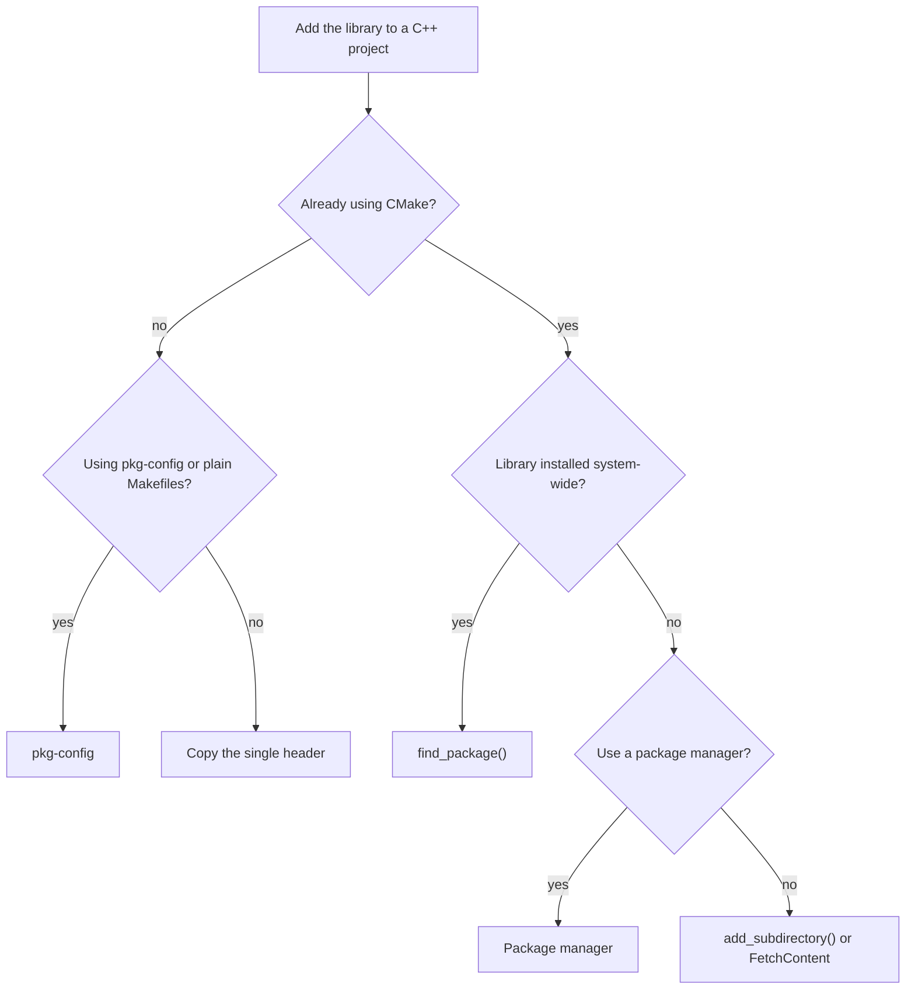

# Integration

There are several ways to add this header-only library to a C++ project. The following flowchart summarizes how to
pick one:



- **Copy the single header**, as described [below](#header-only) — no build-system integration required.
- **CMake**: use [`find_package()`](cmake.md#external) if the library is already installed,
  [`add_subdirectory()`](cmake.md#embedded) to embed the source tree, or [`FetchContent`](cmake.md#fetchcontent) to
  download it at configure time; see [CMake](cmake.md).
- **Package managers**: install the library with a package manager such as Homebrew, Conan, or vcpkg; see
  [Package Managers](package_managers.md).
- **pkg-config**: if you use bare Makefiles instead of CMake, [pkg-config](pkg-config.md) can supply the include flags
  for an already-installed library.

Once the library is integrated, see the [Migration Guide](migration_guide.md) for how to keep your code future-proof
across releases.

## Header only

[`json.hpp`](https://github.com/nlohmann/json/blob/develop/single_include/nlohmann/json.hpp) is the single required
file in `single_include/nlohmann` or [released here](https://github.com/nlohmann/json/releases). You need to add

```cpp
#include <nlohmann/json.hpp>

// for convenience
using json = nlohmann::json;
```

to the files you want to process JSON and set the necessary switches to enable C++11 (e.g., `-std=c++11` for GCC and
Clang).

You can further use file
[`single_include/nlohmann/json_fwd.hpp`](https://github.com/nlohmann/json/blob/develop/single_include/nlohmann/json_fwd.hpp)
for forward declarations (see [Compile times](compile_times.md)), and file
[`single_include/nlohmann/json_literals.hpp`](https://github.com/nlohmann/json/blob/develop/single_include/nlohmann/json_literals.hpp)
for the user-defined string literals if you define
[`JSON_NO_AUTOMATIC_UDLS`](../api/macros/json_no_automatic_udls.md).

For the read-only, non-owning [`basic_json_document`](../api/basic_json_document/index.md)/[`basic_json_view`](../api/basic_json_view/index.md)
types, additionally include
[`single_include/nlohmann/json_view.hpp`](https://github.com/nlohmann/json/blob/develop/single_include/nlohmann/json_view.hpp);
see [Zero-copy JSON views](../features/json_view.md).
