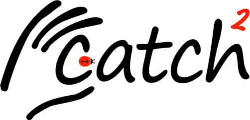

<!-- We can eventually bring this back, but the upload script will have to be more complex -->
<!--  -->

## Catch2 is released!

If you've been using an earlier version of Catch, please see the
Breaking Changes section of [the release notes](https://github.com/catchorg/Catch2/releases/tag/v2.0.1)
before moving to Catch2. You might also like to read [this blog post](https://levelofindirection.com/blog/catch2-released.html) for more details.

## What's the Catch?

Catch2 is a multi-paradigm test framework for C++.

## How to use it
This documentation comprises these three parts:

* [Why do we need yet another C++ Test Framework?](docs/why-catch.md#top)
* [Tutorial](docs/tutorial.md#top) - getting started
* [Reference section](docs/Readme.md#top) - all the details

## More
* Issues and bugs can be raised on the [Issue tracker on GitHub](https://github.com/catchorg/Catch2/issues)
* For discussion or questions please use [the dedicated Google Groups forum](https://groups.google.com/forum/?fromgroups#!forum/catch-forum) or our [Discord](https://discord.gg/4CWS9zD)
* See [who else is using Catch2](docs/opensource-users.md#top)
