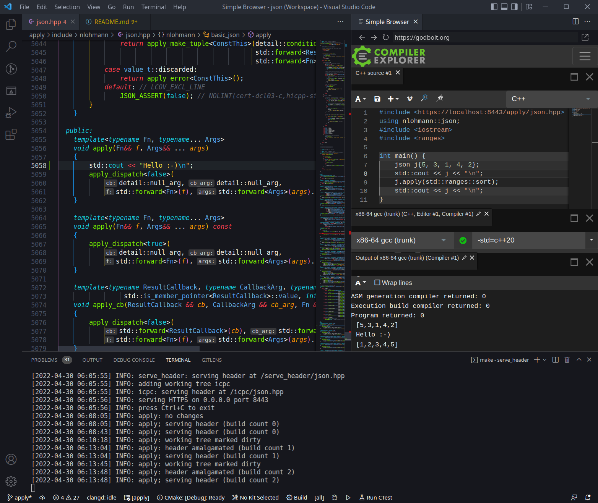

serve_header.py
===============

Serves the `single_include/nlohmann/json.hpp` header file over HTTP(S).

The header file is automatically amalgamated on demand.



## Prerequisites

1. Make sure these Python packages are installed.
    ```
    PyYAML
    watchdog
    ```
    (see `tools/serve_header/requirements.txt`)

2. To serve the header over HTTPS (which is required by Compiler Explorer at this time), a certificate is needed.
   The recommended method for creating a locally-trusted certificate is to use [`mkcert`](https://github.com/FiloSottile/mkcert).
   - Install the `mkcert` certificate authority into your trust store(s):
     ```
     $ mkcert -install
     ```
   - Create a certificate for `localhost`:
     ```
     $ mkcert localhost
     ```
     The command will create two files, `localhost.pem` and `localhost-key.pem`, in the current working directory. It is recommended to create them in the top level or project root directory.

## Usage

`serve_header.py` has a built-in default configuration that will serve the `single_include/nlohmann/json.hpp` header file relative to the top level or project root directory it is homed in.
The built-in configuration expects the certificate `localhost.pem` and the private key `localhost-key.pem`to be located in the top level or project root directory.

To start serving the `json.hpp` header file at `https://localhost:8443/json.hpp`, run this command from the top level or project root directory:
```
$ make serve_header
```

Open [Compiler Explorer](https://godbolt.org/) and try it out:
```cpp
#include <https://localhost:8443/json.hpp>
using namespace nlohmann;

#include <iostream>

int main() {
    // these macros are dynamically injected into the header file
    std::cout << JSON_BUILD_TIME << " (" << JSON_BUILD_COUNT << ")\n";

    return 0;
}
```

> `serve_header.py` dynamically injects the macros `JSON_BUILD_COUNT` and `JSON_BUILD_TIME` into the served header file. By comparing build count or time output from the compiled program with the output from `serve_header.py`, one can be reasonably sure the compiled code uses the expected revision of the header file.

## Configuration

`serve_header.py` will try to read a configuration file `serve_header.yml` in the top level or project root directory, and will fall back on built-in defaults if the file cannot be read.
An annotated example configuration can be found in `tools/serve_header/serve_header.yml.example`.

## Serving `json.hpp` from multiple project directory instances or working trees

`serve_header.py` was designed with the goal of supporting multiple project roots or working trees at the same time.
The recommended directory structure is shown below but `serve_header.py` can work with other structures as well, including a nested hierarchy.
```
json/          ⮜ the parent or web server root directoy
├── develop/   ⮜ the main git checkout
│   └── ...
├── feature1/
│   └── ...      any number of additional
├── feature2/  ⮜ working trees (e.g., created
│   └── ...      with git worktree)
└── feature3/
    └── ...
```

To serve the header of each working tree at `https://localhost:8443/<worktree>/json.hpp`, a configuration file is needed.
1. Create the file `serve_header.yml` in the top level or project root directory of any working tree:
    ```yaml
    root: ..
    ```
   By shifting the web server root directory up one level, the `single_include/nlohmann/json.hpp` header files relative to each sibling directory or working tree will be served.

2. Start `serve_header.py` by running this command from the same top level or project root directory the configuration file is located in:
    ```
    $ make serve_header
    ```

`serve_header.py` will automatically detect the addition or removal of working trees anywhere within the configured web server root directory.
